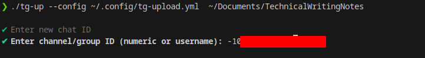
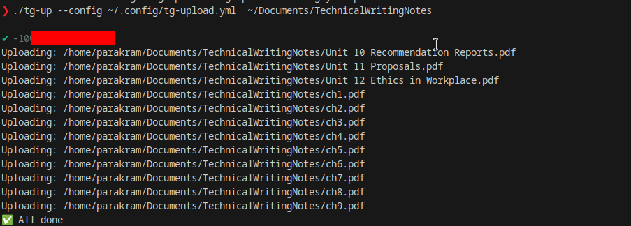
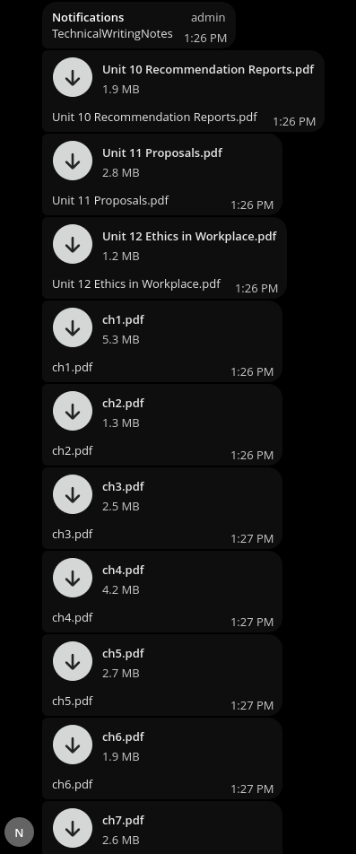

# tg-up — Telegram Folder/File Uploader (Go)

A tiny cross-platform CLI tool that uploads files and folders recursively to Telegram using a bot.

## Features
- Upload files or entire folders
- Skips already-uploaded files (SQLite tracking)
- Saves chat history for quick reuse
- Natural sorted upload
- Parallel multi-platform builds
- Version/BuildDate/Commit embedded at compile time

---

## Usage

`tg-up --config /path/to/config.yml /path/to/file_or_folder `

### Example

`./tg-up --config ~/.config/tg-upload.yml  ~/Documents/TechnicalWritingNotes`


The tool will:
- Ask for chat ID (with history)
- Send the folder name as a message
- Upload files in order
- Upload subfolders recursively

---

## Config Format

`config.yml`:

```yaml
api_id: 123456
api_hash: "your_api_hash"
bot_token: "123456:ABC-XYZ"
```


## Screenshots




